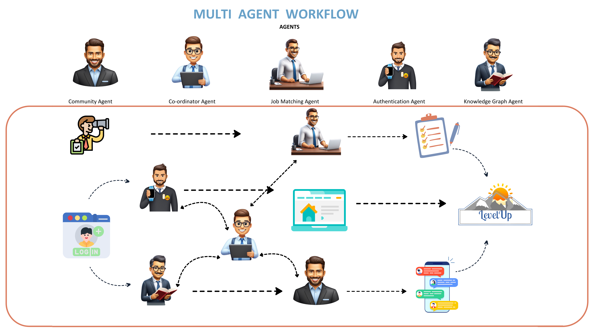

# 🏆 Winning at ISDM CDSSI Hackathon: Code4Change – Our Journey with LevelUp

## 🏅 Introduction
Our team secured **1st place** at the **ISDM CDSSI Hackathon: Code4Change**, an event organized by the **Centre for Data Science and Social Impact (CDSSI) at ISDM**, sponsored by **Capgemini**. The hackathon focused on leveraging **data science, AI, and machine learning** to tackle **social challenges**.

---

## 🔍 About the Hackathon
The **ISDM CDSSI Hackathon: Code4Change** encouraged participants to develop **AI-driven solutions** for **real-world social issues**. The competition involved:
- Receiving a **problem statement** and dataset 📊.
- Developing AI-powered solutions 🤖 and submitting models.
- Evaluation by a **panel of AI & social impact experts** 👨‍⚖️.
- Selection of the **top 6 teams** for final project presentations.

### 🎓 Jury Panel
The distinguished **jury panel** included:
- **Uthara Narayanan** – Co-Founder & Chief Changemaker, Buzz Women
- **Aarti Krishan** – Head of Research, Sattva, IPN
- **Chirag Singla** – Founder & CTO, FIGR
- **Ravali Pidaparthi** – Co-Founder & CEO, Esther
- **Raman Kumar** – Research Associate, ICTD Lab, IIT Delhi
- **Prashant Mehra** – Co-Founder, Platform Commons

Their insights helped refine our final solution and approach.

---

## 🚀 Our Winning Project: LevelUp
### **⚠️ Problem Statement**
Despite India's **economic growth**, **women’s workforce participation** remains **low**, especially in **rural areas**. There exists a significant **gap** between skills and employment opportunities, making it difficult for women to transition into formal jobs.

### **💡 What is LevelUp?**
LevelUp is an AI-powered **employability and upskilling platform** that helps women:
- **Match their skills** with **job opportunities** and **upskilling resources**.
- **Access learning modules** in **regional languages** 🗣️.
- **Connect with mentors and communities** for support 👥.
- **Monetize their skills** through **freelancing and entrepreneurship** 💼.

### **🌟 Core Features**
#### 1️⃣ AI-Driven Skill Mapping 🎯
✅ Users input their skills via **text**.
✅ AI suggests **jobs, training programs, and entrepreneurial opportunities**.

#### 2️⃣ Personalized Learning Paths 📚
✅ Industry-specific **learning resources** 🏭.
✅ Multilingual content 🌎.
✅ Sector-specific upskilling for **better employability**.

#### 3️⃣ Community & Mentorship 🤝
✅ Users receive guidance from **regional mentors** 🏡.
✅ Strong **peer-support network**.
✅ Encouragement to **stay engaged in career growth**.

---

## 🤖 Advanced AI & Tech Innovations
## 🔄 Workflows

### **Multi-Agentic AI Systems**
We built **five AI agents** to handle:
- **User authentication** 🔑.
- **Dynamic job recommendations** 📌.
- **Automated content delivery** 📩.
- **Community engagement tracking** 👥.
- **Connecting like-minded users via knowledge graphs** 🔗.

### **Neo4j Knowledge Graphs**
Our **knowledge graph database** helps:
- **Identify skill gaps & map career paths** 🛤️.
- **Generate personalized recommendations** 🎯.
- **Establish relationships between industries & job roles** 🔄.

---

## 🛠️ Tech Stack
### **🖥️ Development & Deployment**
- **Frontend**: Flutter (for web & mobile applications)
- **Backend**: Python, Flask, Node.js
- **API**: REST API, CI/CD Pipelines

### **📊 AI & Data Science**
- **Matplotlib & Seaborn** – Data visualization
- **Pandas & NumPy** – Data processing
- **Tavily** – Web scraping for real-time job data

### **📂 Databases & Tools**
- **Neo4j** – Graph-based skill mapping
- **SQLAlchemy** – Database integration

---

## 🎯 Impact & Future Scope
### **🌍 Impact of LevelUp**
✅ **Bridging the employment gap** for women in **rural and urban India**.
✅ **Upskilling and financial independence** for job seekers 👩‍💼.
✅ **Empowering women** through mentorship & community support.

### **🚀 Future Enhancements**
✅ Expanding datasets to **more industries & languages**.
✅ Integrating **financial tools** for women entrepreneurs 💰.
✅ **Partnering with NGOs & corporates** to scale impact.
✅ **Multilingual AI support** 🗣️.

---

## 🎙️ Reflections on Winning the Hackathon
🏆 we won the hackathon under the theme **Youth Employability** at **Code4Change** was an incredible experience. Competing with **talented teams** and presenting to **renowned AI experts** was both challenging and rewarding.

### **Key Takeaways** 📌
✅ **Innovation + Feasibility = Impact** 🚀.
✅ **Collaboration is key** – A diverse team strengthens solutions 💡.
✅ **AI can drive real social change** – Technology can empower marginalized communities 🌍.
✅ **Valuable industry insights** on transforming projects into scalable products 📈.

Beyond the hackathon, NGOs and industry experts have reached out for **collaborations**. We are excited to continue developing **LevelUp** and making a real difference in women’s employability! 💼✨

---

## 📢 Conclusion
The **ISDM CDSSI Hackathon: Code4Change** was not just a competition—it was a **stepping stone to creating real social impact** through **AI and data-driven solutions**.

With continued efforts, **LevelUp** has the potential to:
✅ **Transform the landscape of women’s employment** in India 🇮🇳.
✅ **Bridge skill gaps & create sustainable job opportunities**.
✅ **Empower women economically** through AI-driven strategies 💡.

🚀 **Stay tuned as we scale our solution, collaborate with NGOs, and drive long-term impact!**

---

🙏 **Thank You!** 🎉
